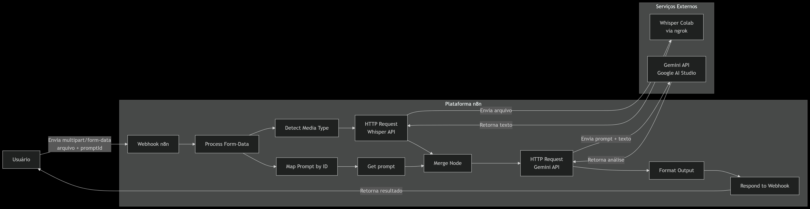

# 🚀 **Transcribe & Think**
### Automação Inteligente de Reuniões com n8n + Google Colab

> Projeto desenvolvido para uma **competição interna de automação low-code**. Nosso objetivo foi criar uma solução acessível e funcional que **transcreve reuniões e gera documentos estruturados**, utilizando ferramentas **totalmente gratuitas** e abertas.

<br>

<p align="center">
  
</p>
---

## ✨ **Visão Geral e Valor do Projeto**

O conteúdo falado em reuniões é um ativo valioso, mas muitas vezes se perde ou é registrado de forma incompleta. O **Transcribe & Think** resolve esse problema, transformando gravações de áudio/vídeo em documentos acionáveis em poucos minutos.

O projeto se destaca por:

- **✍️ Reduzir o retrabalho:** Elimina a necessidade de transcrição manual e de longas horas na criação de atas e relatórios.
- **🧠 Capturar insights:** Garante que informações críticas e decisões importantes sejam registradas de forma consistente.
- **⚡ Agilizar a ação:** Facilita o rastreamento de tarefas, pendências e responsáveis, acelerando o fluxo de trabalho da equipe.

É a solução ideal para equipes que precisam de agilidade e documentação precisa em ambientes de desenvolvimento ágil, reuniões comerciais e comitês de gestão.

---

## ⚙️ **Tecnologias Utilizadas**

O projeto é uma prova de conceito de uma arquitetura baseada em eventos, combinando a flexibilidade do low-code com o poder da inteligência artificial.

| Componente | Tecnologia | Função |
| :--- | :--- | :--- |
| **Orquestração** | **[n8n](https://n8n.io)** | O cérebro da automação. Conecta todas as APIs e orquestra o fluxo de dados. |
| **Interface** | **Webhook n8n** | Ponto de entrada que recebe os arquivos de mídia via requisição `POST`. |
| **Transcrição** | **[Whisper AI](https://github.com/openai/whisper)** | Ouve o áudio e o converte em texto com alta precisão. Hospedado no Google Colab. |
| **Análise** | **[Gemini 1.5 Flash](https://ai.google.dev/models/gemini)** | Analisa o texto transcrito e gera os documentos estruturados a partir de prompts. |

---

## ➡️ **Fluxo de Processamento (Passo a Passo)**

O fluxo no **n8n** é otimizado com processamento em paralelo para máxima eficiência.

1.  **Recepção:** O **Webhook** do n8n recebe o arquivo de áudio/vídeo e o ID do prompt desejado.
2.  **Paralelismo:** O fluxo se divide em duas frentes simultâneas:
    * O arquivo é enviado para a **API do Whisper** (hospedada no Colab) para ser transcrito.
    * O ID do prompt é mapeado para o **prompt textual** correspondente.
3.  **Fusão & Análise:** A transcrição e o prompt são combinados e enviados para a **API do Gemini**.
4.  **Entrega:** O nó final **"Format Output"** limpa a resposta da IA, a estrutura em um JSON padronizado e a retorna via **Webhook**.

---

## 🗂️ **Formatos de Saída (6 Prompts)**

O projeto suporta **6 formatos de saída distintos**, cada um gerado por um prompt específico. A saída é sempre um JSON padronizado, facilitando a integração com outras ferramentas.

1.  **Resumo da Reunião**
2.  **Necessidades do Cliente**
3.  **Proposta Comercial**
4.  **Relatório Técnico Detalhado**
5.  **Lista de Tarefas**
6.  **Ata de Reunião**

### 📦 Estrutura Padrão do JSON de Saída

```json
{
  "tipoDeDocumento": "string",
  "textoLimpo": "string",
  "estruturado": { },
  "temPendencias": true/false,
  "temTarefas": true/false
}
🏃 Como Usar este Projeto
Rodar a API no Colab:

Abra o notebook do projeto no Google Colab.

Configure seu NGROK_AUTH_TOKEN na célula de variáveis de ambiente.

Execute todas as células. Copie a URL pública gerada pelo ngrok.

Importar o Workflow no n8n:

Importe o arquivo n8n/workflow.json na sua instância do n8n.

Atualize o endpoint do nó "HTTP Request Whisper API" com a URL que você copiou do ngrok.

Testar com cURL:

Bash

curl -X POST "https://SEU_NGROK/transcribe" \
  -H "Content-Type: multipart/form-data" \
  -F "file=@/caminho/para/seu/arquivo.mp3" \
  -F "promptId=1"
🚧 Limitações do Protótipo
Este projeto foi construído como uma prova de conceito em um ambiente de desenvolvimento. Por utilizar versões gratuitas e efêmeras das tecnologias, ele possui algumas limitações:

⏱️ Duração de áudio: Os testes foram realizados com vídeos curtos (até 10 minutos) devido aos limites de processamento das versões gratuitas.

🔄 Sessões efêmeras: O Google Colab e o ngrok podem expirar após algumas horas, exigindo uma nova configuração.

🧠 Precisão: O modelo Whisper-small foi usado por questões de custo, sendo menos preciso do que as versões maiores.

🗣️ Cenários complexos: Casos de uso com múltiplos falantes, sotaques fortes, ruído de fundo e sobreposição de vozes não foram totalmente validados.

🤝 Conclusão
O Transcribe & Think demonstra a viabilidade de construir automações inteligentes e de alto valor utilizando uma abordagem low-code. Ele serve como uma base sólida para um produto que, com os devidos aprimoramentos de infraestrutura e escalabilidade, pode se tornar uma ferramenta indispensável no ambiente corporativo.

Fique à vontade para explorar, testar e, se possível, contribuir para este projeto!